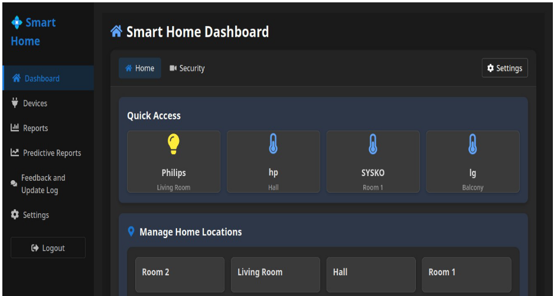
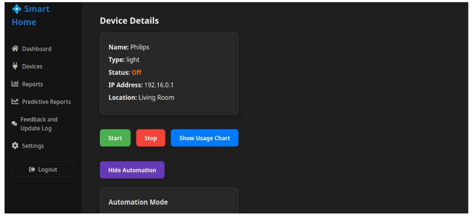
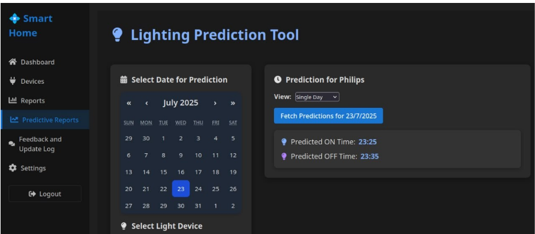

<<<<<<< HEAD
# Smart-Home
A MERN Stack project for automating smart home devices .
=======
# Smart Home Dashboard

A modern MERN stack application for monitoring and controlling smart home devices. This application features a responsive dashboard for thermostat control, light management, security camera monitoring, energy usage tracking, and environment monitoring.

## Features

- User authentication and authorization
- Interactive dashboard to control smart devices
- Real-time device status updates
- Automation scheduling
- Energy usage monitoring
- Mobile-responsive design

## Tech Stack

- **Frontend**: React, React Router, Styled Components, Axios
- **Backend**: Node.js, Express
- **Database**: MongoDB
- **Authentication**: JWT (JSON Web Tokens)

## Project Structure

```
smart-home/
├── client/                  # React frontend
│   ├── public/              # Static files
│   ├── src/                 # Source code
│   │   ├── components/      # Reusable components
│   │   ├── pages/           # Page components
│   │   ├── utils/           # Utility functions
│   │   ├── context/         # Context providers
│   │   └── App.jsx          # Main application component
│   └── package.json         # Frontend dependencies
├── server/                  # Node.js backend
│   ├── config/              # Configuration files
│   ├── controllers/         # Request handlers
│   ├── middleware/          # Custom middleware
│   ├── models/              # MongoDB models
│   ├── routes/              # API routes
│   ├── server.js            # Server entry point
│   └── package.json         # Backend dependencies
└── README.md                # Project documentation
```

## 📸 Screenshots

### Home Page


### Device Details

### Light Prediction

### Weather Prediction

